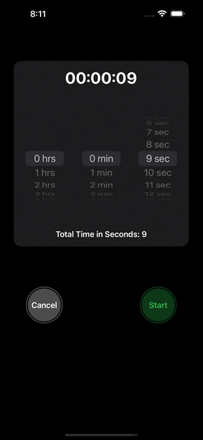

# TimerApp ⏲️

**TimerApp** is a simple SwiftUI-based timer application. It allows users to select a specific time, track progress visually, and play a sound when the timer finishes. This project is built using the **MVVM** (Model-View-ViewModel) architecture to maintain clean and organized code.

## Features ✨

- **Timer Selection**:  
  Choose hours, minutes, and seconds using a user-friendly picker interface.
  
- **Progress Tracking**:  
  A circular progress view dynamically updates to show the remaining time as the timer counts down.
  
- **Sound Notification**:  
  Plays a system sound when the timer finishes to alert the user.

## Screenshots 📸

## Requirements 📋

- iOS 17.0
- Xcode 15.0
- Swift 5.0
